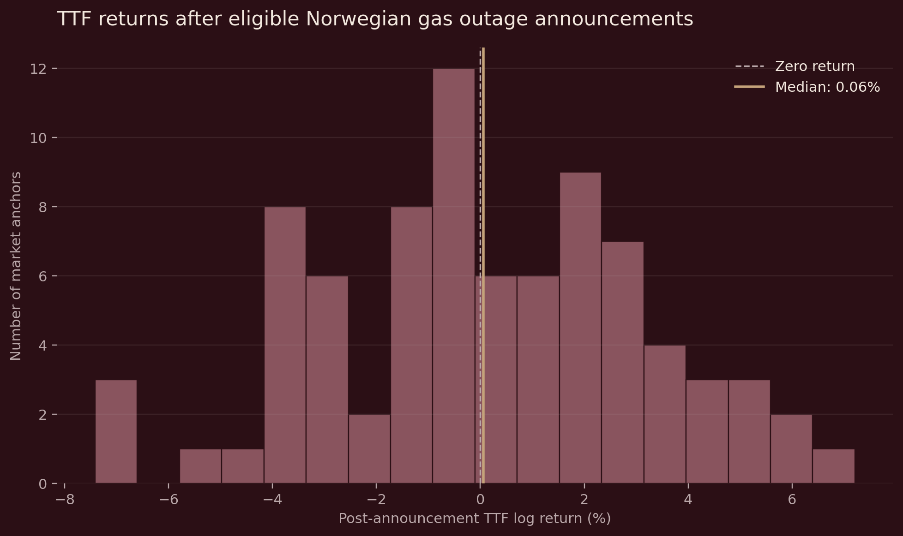
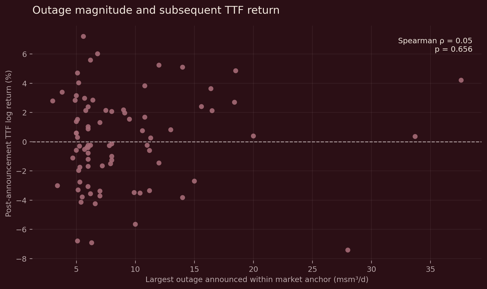

# Norwegian Gas Outages & TTF

*European Gas Markets · Python · PostgreSQL · Event Study*

## Research Question

**How do near-term TTF prices behave around first announcements of unplanned Norwegian gas outages, and do outage magnitude or publication timing help explain the observed movements?**

Norwegian gas disruptions can change expectations of supply available to Europe. However, reported unavailable capacity does not necessarily represent an unexpected loss of gas. A disruption may already be anticipated, offset elsewhere in the Norwegian system or overshadowed by wider market developments.

I reconstructed Gassco outage announcements using Python and PostgreSQL, aligned eligible first disclosures with observed TTF futures prices, and examined the distribution of daily returns around those announcements.

### At a glance

| Metric | Result |
|---|---:|
| Gassco messages audited | **376** |
| Eligible first-revision announcements | **166** |
| Unique TTF market anchors | **130** |
| Non-overlapping analysis sample | **82** |
| Median post-anchor return | **+0.057%** |
| 95% bootstrap interval | **−0.526% to +0.925%** |

**Main finding:** The analysis does not identify a consistent directional TTF return across the selected daily event windows. Outage magnitude and publication timing also show little evidence of systematic associations with subsequent signed returns.

These findings do not establish that Norwegian outages have no price impact. The study measures observed daily market movements rather than isolating the causal effect of each announcement.

## Data Engineering & Event Reconstruction

The first challenge was constructing a reliable event dataset from operational outage disclosures.

Gassco publishes information about infrastructure disruptions, including affected assets, unavailable capacity, operational periods and subsequent revisions. Treating each message as a separate market event would risk counting repeated information as independent announcements.

I developed a workflow that separates event reconstruction from market analysis.

**Workflow**

1. **Python ingestion:** Preserve original source files and standardise identifiers, timestamps and capacity fields.
2. **PostgreSQL validation:** Examine revisions, capacity inconsistencies, publication timing and event eligibility.
3. **Event reconstruction:** Identify 166 eligible first-revision reduction announcements, excluding later updates from the primary event definition.
4. **TTF alignment:** Map disclosures onto an indexed series of observed futures prices.
5. **Event consolidation:** Combine announcements sharing the same market-date anchor.
6. **Statistical analysis:** Examine return distributions, outage magnitude, publication timing and overlapping-event sensitivity.

### Event Funnel

| Analytical level | Observations | Purpose |
|---|---:|---|
| Eligible announcements | **166** | Preserve outage and disclosure characteristics |
| Unique market anchors | **130** | Avoid duplicating identical price-return windows |
| Non-overlapping anchors | **82** | Reduce overlap between selected return windows |

Of the 130 unique anchors, **22 contain multiple eligible announcements**, accounting for 58 individual disclosures.

These announcements cannot be treated as independent observations of market behaviour when several share the same TTF return window.

The analysis therefore retains announcement-level data for operational characteristics while consolidating observations at the market-date level.

A further chronological selection requires at least three observed TTF price intervals between retained anchors, leaving 82 observations for exploratory statistical inference.

This reduces mechanical overlap, although the selected sample remains dependent on the chronological selection rule.

## TTF Validation & Market Alignment

The latest TTF dataset contains **591 unique vendor-labelled price observations**, covering 1 July 2024 to 17 September 2026.

The series comes from Investing.com's Dutch TTF continuous futures data. Validation examines numerical consistency, duplicate observations, OHLC relationships, calendar gaps and return calculations.

Of the 166 eligible announcements:

- **117** have a same-calendar-date TTF observation.
- **49** require alignment to a subsequent observed market date.
- Of those 49, **30** move forward one calendar day, **18** move two days and **one** moves three days.

### Why publication timing matters

Of the eligible announcements, **110 were published after the reported operational outage start**, while 56 were published before or at the start.

The physical beginning of an outage and the arrival of new public information are therefore not necessarily the same event.

The analysis uses first disclosure as the conceptual information event rather than assuming the operational start represents when the market first learns about the disruption.

The primary return is calculated as:

\[
R_{i,[0,+1]}=100\ln\left(\frac{P_{a_i+1}}{P_{a_i}}\right)
\]

where \(P_{a_i}\) is the price at the assigned market anchor and \(P_{a_i+1}\) is the next observed price.

Because the dataset contains daily observations rather than intraday quotations, this return cannot necessarily capture the entire market reaction following publication.

## Empirical Results

### 1. Distribution of TTF returns

Across the 130 unique market anchors, the reported median post-anchor return is **+0.279%**.

The full sample is retained for descriptive analysis because some event windows overlap.

The 82-anchor sample produces:

| Statistic | Result |
|---|---:|
| Median return | **+0.057%** |
| Reported 95% bootstrap interval | **−0.526% to +0.925%** |
| Wilcoxon signed-rank p-value | **0.689** |

The reported interval includes zero, and the Wilcoxon test does not detect a systematic signed-rank shift away from zero.

These results do not demonstrate that the underlying economic effect is zero. The bootstrap also treats the selected observations as independent, an assumption that is not fully established.

*Figure 1. Distribution of observed anchor-to-next-observation returns. Both positive and negative movements occur, with the sample median close to zero.*

### 2. Outage magnitude and subsequent returns

I examined whether larger reported capacity reductions were associated with systematically different TTF returns.

The analysis uses the largest individual communicated outage within each market anchor.

| Measure | Result |
|---|---:|
| Spearman rank correlation | **+0.050** |
| p-value | **0.656** |

The estimated monotonic relationship between outage magnitude and subsequent signed returns is close to zero.

*Figure 2. Largest individual reported outage within each selected market anchor against the subsequent daily TTF return.*

Reported unavailable capacity is not equivalent to the unexpected aggregate loss of Norwegian gas supply. This distinction limits what can be inferred from the correlation.

### 3. Publication timing

The analysis also compares returns based on whether the largest outage announcement was published before or after its reported operational start.

| Publication group | Median return |
|---|---:|
| Published after operational start | **−0.246%** |
| Published before or at operational start | **+0.753%** |

The Mann–Whitney test gives **p = 0.496**, providing little evidence of systematic rank separation between the groups.

This comparison concerns publication relative to the physical outage start, not publication relative to a verified TTF closing-price timestamp.

### 4. Event versus non-event periods

To examine whether outage-associated market movements were unusual, I also compared their absolute returns with selected non-event TTF observations.

| Sample | Mean absolute return |
|---|---:|
| Event-associated anchors | **2.40%** |
| Selected non-event dates | **2.72%** |

In this descriptive comparison, event-associated windows do not exhibit larger average absolute returns.

However, the comparison is not a fully matched counterfactual. Differences in volatility regimes, calendar conditions and competing market information may affect the results.

## Commercial Interpretation

The central economic distinction is between **headline unavailable capacity and the unexpected change in net Norwegian supply**.

A large outage may produce little observable price movement if the market already anticipated it, if production elsewhere offsets the disruption, or if other developments dominate.

Conversely, a smaller disruption could be commercially important if it reveals an unexpected supply constraint during a period of tight European gas availability.

For an energy-market analyst, the more useful question is therefore:

**How much new supply information has reached the market, what alternatives are available, and how exposed is the European gas balance at that moment?**

A stronger risk model would combine verified publication timing with actual Norwegian gas flows, affected infrastructure, outage duration, LNG availability, storage, weather and the TTF forward curve.

The current study establishes an event-reconstruction and exploratory analytical framework, rather than a validated forecasting or trading model.

## Limitations & Further Research

Several limitations remain important:

**Price observability:** Daily prices cannot isolate an instantaneous announcement reaction. The Gassco publication timezone and precise vendor closing-price timestamp remain unverified.

**Continuous futures construction:** The historical TTF series is vendor-provided. Its contract-roll methodology and exact price definition have not been independently established.

**Supply-shock measurement:** Announced unavailable capacity does not directly measure realised lost gas flows or the unexpected information priced by market participants.

**Sample selection:** The 82-anchor sample reduces mechanical return overlap but depends on a chronological selection rule. Related outages, shared market news and changes in volatility regimes may still create statistical dependence.

**Reproducibility:** The latest findings are documented in the analysis notebooks, but the complete final dataset and upstream selection pipeline have not yet been independently rerun together.

The next stage is to verify market-price chronology, test alternative non-overlapping event selections and develop a more closely matched non-event benchmark.

These improvements would help establish whether Norwegian outage disclosures provide information beyond prevailing TTF volatility and wider European gas-market conditions.

## Technical Repository

The Python, PostgreSQL and statistical-analysis workflow is documented in the technical repository, including market-data validation, event alignment and the latest event-study notebooks.

[View technical repository ↗](https://github.com/jauricestudios/norway-ttf-event-study)

*Research status: Observational daily event-window study. Results should not be interpreted as isolated causal estimates of Norwegian outage impacts on TTF prices.*cestudios/norway-ttf-event-study)
